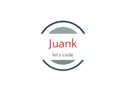

  
   

<!-- TABLE OF CONTENTS -->

# 📗 Table of Contents

- [📖 About the Project](#about-project)
  - [🛠 Built With](#built-with)
    - [Tech Stack](#tech-stack)
    - [Key Features](#key-features)
  - [🚀 Live Demo](#live-demo)
- [💻 Getting Started](#getting-started)
  - [Setup](#setup)
  - [Prerequisites](#prerequisites)
  - [Install](#install)
  - [Usage](#usage)
  - [Run tests](#run-tests)
  - [Deployment](#triangular_flag_on_post-deployment)
- [👥 Authors](#authors)
- [🔭 Future Features](#future-features)
- [🤝 Contributing](#contributing)
- [⭐️ Show your support](#support)
- [🙏 Acknowledgements](#acknowledgements)
- [❓ FAQ](#faq)
- [📝 License](#license)

<!-- PROJECT DESCRIPTION -->

# 📖 [your_project_name] 

"To-Do List" is a simple website that displays a list of activities and allows you to add and remove activities from that list. By building this application, we learned how to manage data using JavaScript. Thanks to that your website will be more interactive.

## 🛠 Built With 

### Tech Stack 

- HTML
- JavaScript
- CSS
- Webpack

<!-- Features -->

### Key Features 

- **Javascript DOM manipulation**

(<a href="#readme-top">back to top</a>)

<!-- LIVE DEMO -->

## 🚀 Live Demo 

[Live Demo Link] (...come soon)

(<a href="#readme-top">back to top</a>)

<!-- GETTING STARTED -->

## 💻 Getting Started 

### Prerequisites

* Have git installed. (For version control)
* Have text editor installed. (VSCode, sublime, atom)
* Have CSS,HTML & JS Linters installed and configured. For further information, visit [this link](https://github.com/microverseinc/linters-config/blob/master/README.md) to get better understanding on each linters used on this project.

### Setup

Clone this repository to your desired folder:

git clone git@github.com:Juank628/to_do_list.git

### Install

Install this project with:

npm install

### Usage

This page registers to-do activities. To register an activity:
1. Type the activity's description.
2. Press enter key.
3. The activity will be added to the list and will be displayed.

To remove a book from the list:
1. Find the activity in the list.
2. Click on the more button for the respective activity.
3. Click on the delete button.

<!-- AUTHORS -->

## 👥 Authors 

👤 **Juan Carlos Sanchez**

- GitHub: [@Juank628](https://github.com/Juank628)
- Twitter: [@juancadev81](https://twitter.com/juancadev81)
- LinkedIn: [LinkedIn](https://linkedin.com/in/juan-carlos-sanchez-zunino-271b5151)

👤 **Ivan Martinez von Halle**

- GitHub: [@ivanmvh](https://github.com/ivanmvh)
- Twitter: [@imprivado](https://twitter.com/imprivado)
- LinkedIn: [Iván Martínez von Halle](https://www.linkedin.com/in/ivan-martinez-von-halle/)

(<a href="#readme-top">back to top</a>)

<!-- FUTURE FEATURES -->

## 🔭 Future Features 

- [ ] **Database connection**

(<a href="#readme-top">back to top</a>)

<!-- CONTRIBUTING -->

## 🤝 Contributing 

Contributions, issues, and feature requests are welcome!

Feel free to check the [issues page](https://github.com/Juank628/to_do_list/issues).

(<a href="#readme-top">back to top</a>)

<!-- SUPPORT -->

## ⭐️ Show your support 

If you like this project, please give us an star

(<a href="#readme-top">back to top</a>)
